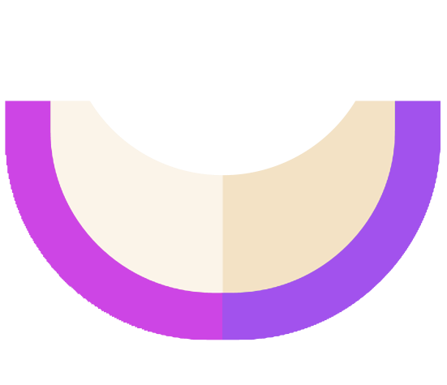

<p align="center">
    
</p>

<!-- omit in toc -->
## Melonly Node.js Framework

<a href="https://www.npmjs.com/package/@melonly/core" target="_blank"></a>
<a href="https://www.npmjs.com/package/@melonly/core" target="_blank"></a>
<a href="https://www.npmjs.com/package/@melonly/core" target="_blank"></a>

Melonly is a fast and modern web development framework for Node.js. It makes easy to create secure and fast web applications with awesome developer experience.

**Table of Contents**

- [Requirements](#requirements)
- [Installation](#installation)
- [Running Application](#running-application)
- [Directory Structure](#directory-structure)
  - [`/database`](#database)
  - [`/public`](#public)
  - [`/src`](#src)
  - [`/storage`](#storage)
  - [`/tests`](#tests)
  - [`/views`](#views)
- [The Basics](#the-basics)
  - [Configuration](#configuration)
  - [Controllers and Routing](#controllers-and-routing)
  - [Views](#views-1)
  - [Services](#services)
  - [HTTP Request and Response](#http-request-and-response)
  - [Mail](#mail)
  - [Websockets and Broadcasting](#websockets-and-broadcasting)
  - [Testing](#testing)
- [License](#license)


## Requirements

- Node.js v16.4.2+
- `npm` installed


## Installation

To create a new Melonly project you can use the CLI installer. First you only have to install `@melonly/cli` package.

```shell
npm install -g @melonly/cli
```

Then you can check the Melonly CLI version if it has been properly installed. Then you'll be able to run `melon` commands:

```shell
# Display Melonly CLI version

melon -v
```

To create new project run the `new` command in your directory:

```shell
melon new <project-name>
```


## Running Application

Once your project has been created you can start it on the local server using `npm start`:

```shell
cd <project-name>

npm start
```

Your application will be available on `localhost:3000` by default. You can change the port in `.env` configuration file.

If you don't want to open the browser automatically, use the `npm run start:dev` command.


## Directory Structure

Default Melonly application structure consists of several main folders:


### `/database`

In this directory database migrations are created. You can also store `sqlite` database there.


### `/public`

This is the only directory visible to users. This is where you should put client side things like compiled styles, JS scripts and images.


### `/src`

The `src` directory contains your application code. Feel free to modify and change it to your needs.


### `/storage`

There are stored cache and temporary files. TypeScript code is compiled into `dist` directory inside this folder. You don't need to edit anything there.


### `/tests`

This directory stores your unit tests (test files end with `.test.ts` extension).


### `/views`

The `views` directory contains app views rendered by your application. View files have `.melon.html` extension.


## The Basics

### Configuration

All app configuration is stored in `.env` file. This is where database credentials and environment-specific settings should be stored. Melonly automatically reads all `.env` variables to `process.env` object available in your code.

```
DATABASE_CONNECTION=mysql
DATABASE_HOST=localhost
```

You can obtain these variables with `process.env`:

```ts
console.log(process.env.DATABASE_HOST)
```


### Controllers and Routing

Now we can develop our application. Main entry file for the Node app is `src/main.ts` file. This is the place where app middleware and controllers are registered. Routing system in Melonly is done using controller classes. Framework already ships with one controller in `src/app/app.controller.ts` file by default:

```ts
import { Controller, Get, Request, Response, ViewResponse } from '@melonly/core'

@Controller()
export class AppController {
    constructor(
        private readonly request: Request,
        private readonly response: Response,
    ) {}

    @Get('/')
    public index(): ViewResponse {
        return this.response.render('home', {
            message: 'Hello World',
        })
    }
}
```

Basically, a controller is just a class which handles web requests. Each controller should contain decorated methods registering routes. In the example above, when the user enters `/` route, the request will be passed to the `index` method which returns a view with passed variable.

Controller routes can be created as dynamic patterns with `:paramName` syntax:

```ts
@Get('/users/:id')
```

To make paramater optional use the question mark:

```ts
@Get('/users/:id?')
```

This route will match both `/users` and `/users/327` paths.


### Views

Melonly includes a built-in view templating engine. Views are placed in `/views` directory and have the `.melon.html` extension.

Melonly's template engine allows you to create loops, conditionals and variable interpolation.

The example template with foreach loop and conditional rendering looks like this:

```html
<h1>{{ title }}</h1>

[each item in [1, 2, 3]]
    <div>{{ item }}</div>
[/each]

[if logged]
    <a href="/logout">Log out</a>
[/if]
```

All directives like conditional blocks and loops use the square brackets and slash syntax. For displaying passed variables use `{{ variable }}` syntax.

Some frontend frameworks like Vue use the same bracket syntax for displaying data. To render raw brackets put `@` sign before them:

```html
@{{ value }}
```

Rendering views is done using the 'dot' syntax for nested folders:

```ts
// This will render views/pages/welcome.melon.html template

return this.response.render('pages.welcome')
```

Note that view file names should not contain dot signs.

You can also customize the default 404 page. All you have to do is to create `views/errors/404.melon.html` file with your custom template. When this file exists, Melonly will serve it as the 404 error page. Otherwise, the default one will be displayed.


### Services

Melonly strongly encourages you to write clean code separated into small parts. We believe that controllers should be only responsible for request and response handling. All other buisness logic should be located in service classes. Service class is an injectable class with methods responsible for transforming some data.

To create new service run the following command:

```shell
melon make service user
```

`user` is just a name for the generated class. The path will look like `src/user/user.service.ts` It will contain the following code:

```ts
import { Injectable } from '@melonly/core'

@Injectable()
export class UserService {
    public getMessage(): string {
        return 'Hello World!'
    }
}
```

Since the class has been declared as injectable, we can type-hint the controller constructor to get injected services:

```ts
import { UserService } from './user.service'

@Controller()
export class UserController {
    constructor(private readonly userService: UserService) {}

    // ...
}
```

Injected services will be automatically available in the controller:

```ts
@Get('/users')
public index(): string {
    return this.userService.getMessage()
}
```


### HTTP Request and Response

Melonly provides a simple API for dealing with web requests and responses. You can inject `Request` and `Response` objects to controller and use them.

```ts
import { Request, Response } from '@melonly/core'

// In controller's constructor

constructor(private readonly request: Request, private readonly response: Response) {}
```

You can get matched url parameters:

```ts
@Get('/users/:id')
public show(): string {
    return this.request.param('id')
}
```

You can also get url query data:

```ts
// Route: /users?view=gallery

const view = this.request.queryParam('view') // 'gallery'
```

To retrieve sent form data, use `request.data` getter:

```html
<!-- in html -->
<input type="text" name="username">
```

```ts
const username = this.request.data.username
```

Example redirect response using the `redirect` method:

```ts
import { RedirectResponse } from '@melonly/core'

@Get('/')
public index(): RedirectResponse {
    return this.response.redirect('/login')
}
```

You can also write response headers:

```ts
this.response.header('Content-Type', 'text/plain')
```


### Mail

Melonly provides a fluent interface for sending emails from your application. All configuration needed for that is stored in the `.env` file variables:

```
MAIL_ADDRESS=example@mail.com
MAIL_SERVICE=gmail
MAIL_PASSWORD=
```

After providing your mail service credentials you'll be able to create and send your first email. The most basic form is writing raw text message from `Mail.send` method:

```ts
import { Email } from '@melonly/core'

Email.send('recipient@mail.com', 'Test Email', 'This is the test email sent from Melonly application.')
```

Even though this is simple and convinient for fast testing, we recommend the more object-oriented approach with separate email classes. It will allow us to make template based emails. To generate new email file use the CLI command:

```shell
melon make email welcome
```

This command will create a new `mail/welcome.email.ts` file. It will look like this:

```ts
import { Email } from '@melonly/core'

export class WelcomeEmail extends Email {
    public subject(): string {
        return 'Welcome'
    }

    public build(): string {
        return this.fromTemplate('mail.welcome')
    }
}
```

In the example above email will render `views/mail.welcome.melon.html` template. You can pass any variables to the template like we done it in view rendering.

Sending emails using this method is very similar. Instead of 

```ts
import { WelcomeEmail } from '../mail/welcome.email'

Email.send('recipient@mail.com', new WelcomeEmail())
```


### Websockets and Broadcasting

Modern applications often require established two-way server connection for real-time data updating. The best option is to use Websocket connections. Melonly provides a powerful API for managing these features.

First though, you should get to know the concept of broadcasting channels. Channel is a class used for namespacing events with its own authorization logic. To create new channel class you may use CLI:

```shell
melon make channel chat
```

This will create new `src/broadcasting/chat.channel.ts` file with the following content:

```ts
import { BroadcastChannel, ChannelInterface } from '@melonly/core'

@BroadcastChannel('chat/:id')
export class ChatChannel implements ChannelInterface {
    public userAuthorized(): boolean {
        return true
    }
}
```

String argument passed to decorator is channel name with dynamic parameter. The `userAuthorized` method is used to determine whether authenticated user is authorized to join the channel on the client side.

Emitting events on the server side can be done using `Broadcaster`:

```ts
import { Broadcaster } from '@melonly/core'

Broadcaster.event('message', `chat/${chatId}`)
```

Now you'll be able to receive broadcasts on the client side.


### Testing

Testing your application is very important. Melonly ships with [Jest](https://jestjs.io) testing library installed by default. Test files are placed in `/tests` directory. Run `npm test command` to see test results:

```shell
npm test

PASS  tests/app.controller.test.ts
  √ asserts response is truthy (1 ms)

Test Suites: 1 passed, 1 total
```


## License

Melonly is an open-source framework licensed under the [MIT License](LICENSE).

Author: [Doc077](https://github.com/Doc077)

If you discovered a bug or security vulnerability please open an issue / pull request in the repository or email me: dom.rajkowski@gmail.com.

**Logo: [Watermelon icons created by Freepik - Flaticon](https://www.flaticon.com/free-icons/watermelon)**
